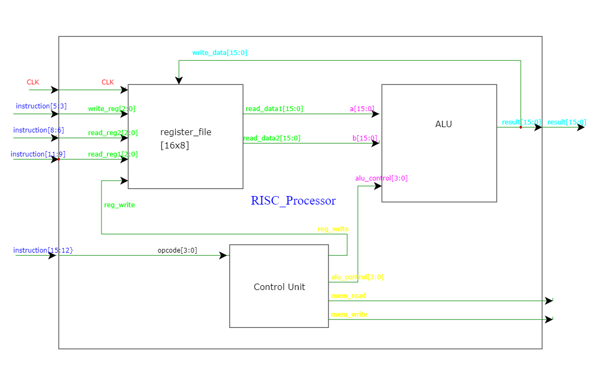

# RISC_verilog
Designing a basic RISC based processor using verilog
The project is a Verilog implementation of a simple RISC processor featuring an 8-register file (register_file), an Arithmetic Logic Unit (ALU) (alu) supporting basic operations like addition, subtraction, bitwise AND/OR/XOR, and NOT, and a Control Unit (control_unit) decoding opcodes to control register accesses, ALU operations, and memory interactions. Integrated in the processor module, it handles 16-bit wide data paths and instructions, executing operations in a single clock cycle per instruction. The design aims to illustrate foundational principles of RISC architectures, emphasizing clarity and educational value in its implementation.

